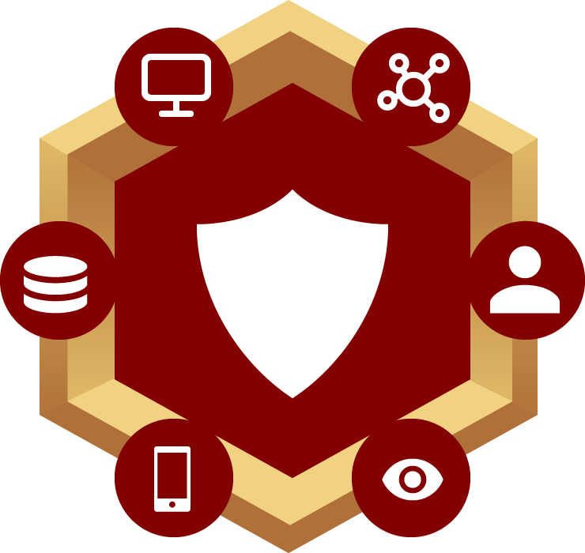
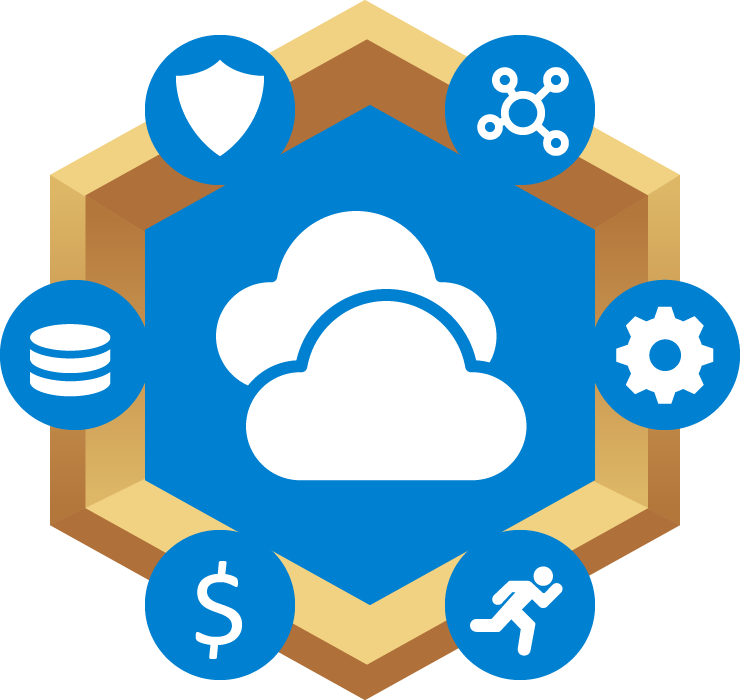
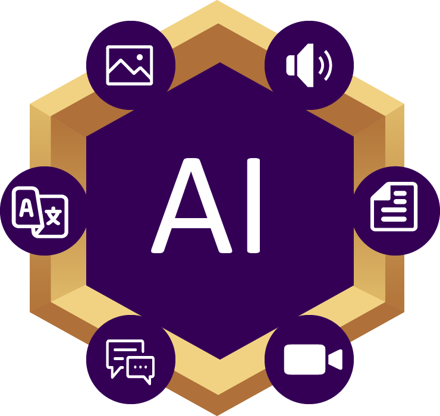
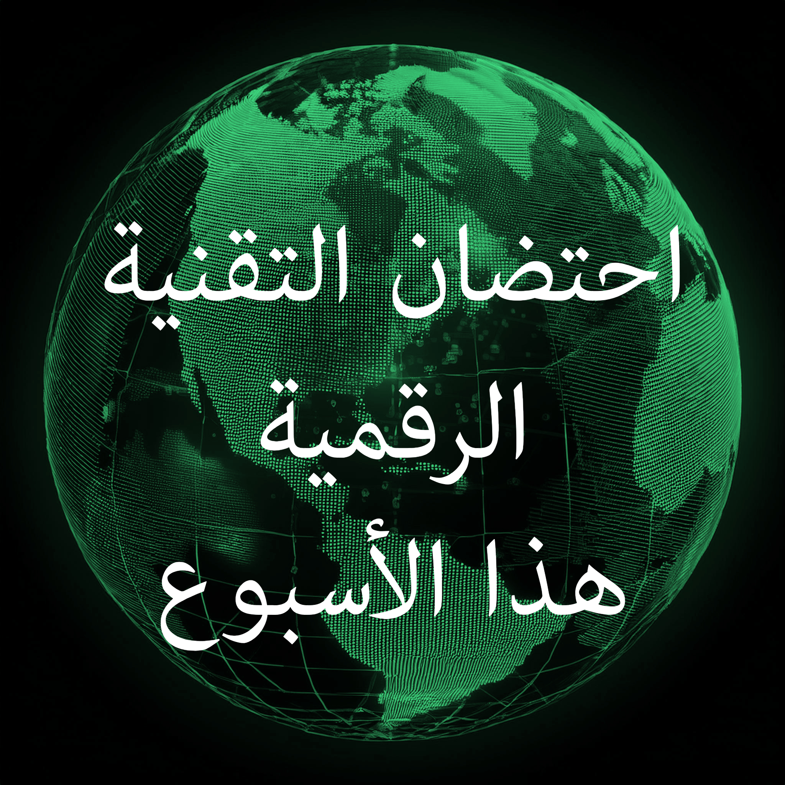

# احتضان التحول الرقمي

"احتضان التحول الرقمي" قد أنشأ ثلاث سلاسل من الحلقات حيث ركزنا محادثاتنا على أهم مواضيع اليوم. تحقق من هذه السلسلة الجديدة.

  

    
  

  

    
  

  

    
  






  

    
 
        "احتضان التحول الرقمي" هو بودكاست أسبوعي يتم بثه على <a href="https://www.youtube.com/channel/UCveOcNne1kP_ZccC8kOZcDA">يوتيوب</a> و <a href="https://soundcloud.com/embracingdigital">ساوند كلاود</a>.
        دارين بولسيفر، المهندس الرئيسي للحلول للقطاع العام في إنتل، يحقق في التحول الفعّال مستخدمًا الناس والعمليات والسياسات والتكنولوجيا.
    

    
 
        نحن نبني مجتمعاً من الممارسين والاستراتيجيين للحديث عن تحديات ونجاحات تبني التحول الرقمي. انضم إلى المجتمع من خلال التحقق من الروابط أدناه:
        <a href="https://www.youtube.com/channel/UCveOcNne1kP_ZccC8kOZcDA">يوتيوب</a>,
        <a href="https://soundcloud.com/embracingdigital">ساوند كلاود</a>,
        <a href="https://www.linkedin.com/company/embracing-digital-transformation/">مجموعة لينكدإن</a>,
        <a href="https://www.facebook.com/embracingdigital">فيسبوك</a>
    

  

  

    <a href="{{ latestEpisode.url }}">
         
        <small>{{ latestEpisode.number}} - {{ latestEpisode.title }}</small>
    </a> 
    <a href="{{ latestBrief.url }}">
         
        <small>النشرة الإخبارية الأسبوعية {{ latestBrief.title }}</small>
    </a> 
  



<h1>الحلقات</h1>



    
    <a href="{{ page.url }}">{{ page.number}} - {{ page.title }}</a> 
    {{ page.summary }}




