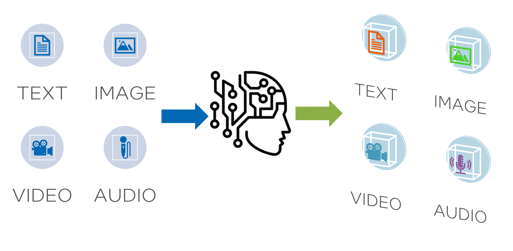

Generative AI refers to artificial intelligence systems that are capable of creating new content such as text, images, audio, and video. These systems have various capabilities that allow them to generate content that is similar to that created by humans. Some of the key capabilities of generative AI include:

* Text Generation: Systems such as GPT-3 can generate human-like text based on a given prompt or source text. These systems are trained on large datasets to learn linguistic patterns and content styles.

* Image Generation: Systems such as DALL-E 2 can generate realistic images from text descriptions. They use deep learning and computer vision techniques to create images.

* Audio Generation: AI systems can generate human-like speech and music by learning from large datasets. Examples of such systems include Google's WaveNet for speech synthesis and Jukebox by OpenAI for music generation.

* Video Generation: Emerging techniques enable AI to generate synthetic video content by analyzing and recombining elements from source images and videos.

The common thread among these generative AI models is that they create original artifacts that mimic the patterns and styles found in the training data. Generative AI has many potential applications in content creation, media, gaming, and more. However, it also raises concerns about authenticity, copyright, and the potential for misuse.

## Embracing Generative AI Services






    

    
    <a href="{{ spage.url }}">{{ spage.number}} - {{ spage.title }}</a> 
    {{ spage.summary }}
    






