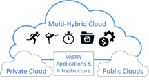

IT organizations are in the middle of a huge paradigm shift. Application developers and line of business owners are demanding agility in their IT infrastructure. IT is having a hard time keeping up and, as a result, they are losing these customers to the public cloud. CIOs are in the process of trying to change, but they are often being driven by the technology fads of the day instead of coming up with a solid strategy moving forward. A multi-hybrid cloud strategy is that solid strategy that helps satisfy the needs of the demanding application developers and line of business owners while keeping IT’s core tenants of efficiency, security and reliability. Multi-hybrid clouds give application developers what they want while still adhering to these tenets through flexibility, agility, predictive performance, efficiency, and security & compliance.

## Embracing Multi-Hybrid Cloud Series

* [Building a Muilti-Hybrid Cloud Strategy](https://www.embracingdigital.org/episode-EDT162-en) - In this episode Darren interviews Christine McMonigal and discuss the challenges organizations face when transitioning to the cloud and adopting multi-hybrid cloud architectures. 
* [Developing a Multi-Hybrid Cloud Operating Model](https://www.embracingdigital.org/episode-EDT163-en) - In this episode Darren interview cloud solution architect, Rajiv Mandal, about developing a multi-hybrid cloud strategy in your modern IT organization.
* [Application and Workload Portfolios in Cloud Migration](https://www.embracingdigital.org/episode-EDT164-en) - In this episode, Darren interviews Sarah Musick, Cloud Solution Architect at Intel. Together, they dive into the topic of application and workload portfolios in cloud migration.
* [Workload Cloud Placement Factors](https://www.embracingdigital.org/episode-EDT165-en) - In this podcast, the Darren and Rico Dutton dive into the world of cloud instances and the factors to consider when selecting the right instance for your workload.
* [Agility in Cloud Adoption](https://www.embracingdigital.org/episode-EDT166-en) - Cloud migration is no longer a one-time process, but rather a continuous journey that requires constant evaluation, monitoring, and adjustment to achieve business objectives.

## Additional Episodes of interest

* [Benefits of Multi-Cloud Architecture](https://www.embracingdigital.org/episode-EDT3-en) - A multi-hybrid cloud architecture allows organizations to take advantage of the benefits of both private and public clouds, optimizing resources and cost efficiency. This model has five main advantages: agility, flexibility, predictive performance, security and compliance, and efficiency.
* [Multi Cloud Data Solutions with Hammerspace](https://www.embracingdigital.org/episode-EDT26-en) - Johan Ballin, Director of Technical Marketing at Hammerspace and Darren Pulsipher, Chief Solution Architect, Public Sector, at Intel discuss Hammerspace’s hybrid cloud technology that untethers data from storage infrastructure, providing data portability and performance.
* [The Role of the CIO in Cloud Adoption](https://www.embracingdigital.org/episode-EDT43-en) - In part one of this interview, Darren Pulsipher, Chief Solution Architect, Intel, and Doug Bourgeois, Managing Director, GPS Cloud Strategy Leader, Deloitte, talk about the cloud migration and the role of the CIO.
* [Cloud in the Digital Age](https://www.embracingdigital.org/episode-EDT44-en) - In part two of the interview, Darren Pulsipher, Chief Solution Architect, Intel, and Doug Bourgeois, Managing Director, GPS Cloud Strategy Leader, Deloitte, continue their discussion about the cloud migration. 
* [Cloud Broker Organizations](https://www.embracingdigital.org/episode-EDT56-en) - In this episode, part one of two, Darren and Intel Cloud Solution Architects Dave Shrestha and Kevin Bleckman talk about the importance of a cloud broker organization. 
* [Telemetry in the Cloud](https://www.embracingdigital.org/episode-EDT52-en) Darren Pulsipher, Chief Solution Architect, Intel, talks to Josh Hilliker, Director of Cloud Solution Architects at Intel about using telemetry in the cloud to maximize value and efficiency.
* [Understanding the Shared Responsibility Security Model](https://www.embracingdigital.org/episode-EDT78-en) Darren Pulsipher, Chief Solution Architect, Intel, explains shared responsibility security models. Who is responsible for security can become murky in the cloud; responsibility depends on cloud service delivery models and other factors.
* [Evolution of Cloud](https://www.embracingdigital.org/episode-EDT138-en) In this episode Darren interviews Ken White from Dell Technology about how Cloud technology is more than technology, but a process and cultural change in organizations.
* [Not All Cores are Equal](https://www.embracingdigital.org/episode-EDT45-en) In this episode, Darren Pulsipher, Chief Solution Architect, Intel, and Stephen Holt, Cloud Solution Architect, Intel discuss cloud optimization and studies that show that cores perform differently for various workloads.
* [Day in the Life of a Cloud Solution Architect](https://www.embracingdigital.org/episode-EDT76-en) On this episode, Darren talks with Kiran Agrahara about what Intel Cloud Solution Architects (CSAs) do in a day to benefit not only cloud service providers (CSPs), but end users.
* [Myths of Lift and Shift Cloud Migration](https://www.embracingdigital.org/episode-EDT112-en) - Darren Pulsipher, Chief Solutions Architect, Public Sector, Intel, and John Evans, Chief Technology Advisor, WWT, discuss five lift and shift cloud migration myths.
