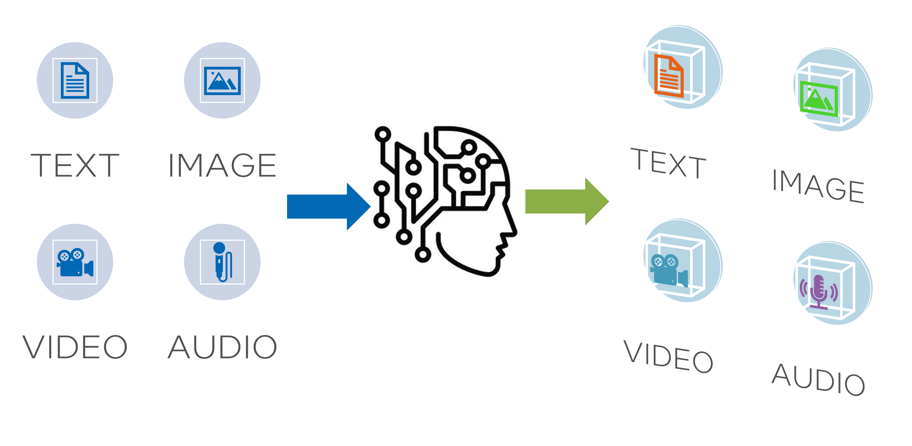

Generative KI bezieht sich auf künstliche Intelligenz-Systeme, die in der Lage sind, neuen Inhalt wie Text, Bilder, Audio und Video zu erstellen. Diese Systeme haben verschiedene Fähigkeiten, die es ihnen ermöglichen, Inhalte zu generieren, die denen ähnlich sind, die von Menschen erstellt wurden. Einige der wichtigsten Fähigkeiten der generativen KI sind:

* Textgenerierung: Systeme wie GPT-3 können menschlich anmutende Texte auf Basis einer gegebenen Aufforderung oder eines Ausgangstextes erstellen. Diese Systeme werden anhand großer Datensätze trainiert, um sprachliche Muster und Inhaltsstile zu erlernen.
* Bildgenerierung: Systeme wie DALL-E 2 können realistische Bilder aus Textbeschreibungen generieren. Sie verwenden Deep Learning und Computer Vision-Techniken, um Bilder zu erstellen.
* Audiogenerierung: KI-Systeme können menschenähnliche Sprache und Musik generieren, indem sie aus umfangreichen Datensätzen lernen. Beispiele für solche Systeme sind Googles WaveNet für Sprachsynthese und Jukebox von OpenAI für die Generierung von Musik.
* Videogenerierung: Neue Techniken ermöglichen es KI, synthetische Video-Inhalte zu generieren, indem sie Elemente aus Quellbildern und -videos analysieren und kombinieren.

Der gemeinsame Faden dieser generativen KI-Modelle ist, dass sie originelle Artefakte erstellen, die die in den Trainingsdaten gefundenen Muster und Stile nachahmen. Generative KI hat viele potenzielle Anwendungen in der Inhaltserstellung, Medien, Gaming und mehr. Allerdings wirft sie auch Bedenken bezüglich Authentizität, Urheberrecht und Missbrauchspotenzial auf.

