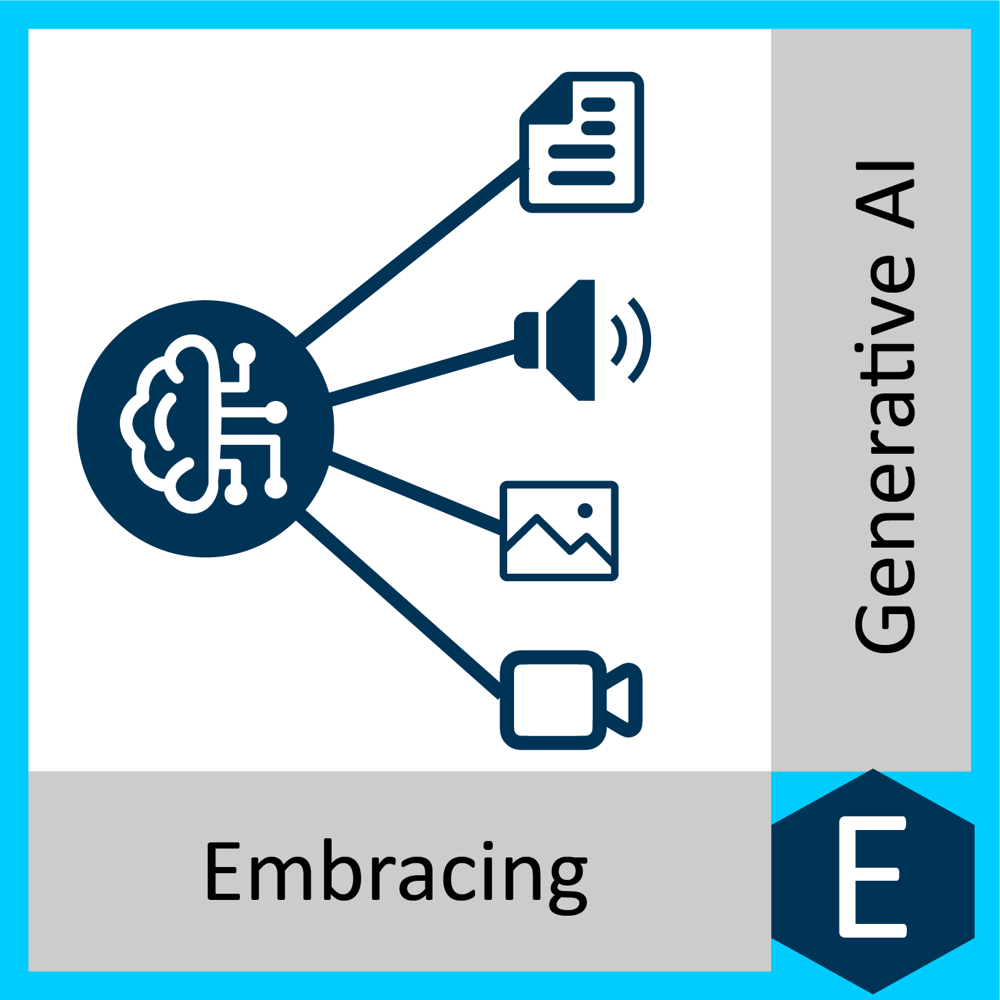



Hot topics come and go in the world of digital transformation. So in Embracing Digital Transformation we have pulled together a library of collections of podcast episodes that have focused on the hot topics of today.

This is a curated collection that delves deep into the cutting-edge realms of Generative AI, Multi-Hybrid Cloud, and Zero Trust Architecture.

In the ever-evolving landscape of digital transformation, staying ahead of the curve is paramount. Businesses today are constantly seeking innovative ways to harness the power of technology, drive efficiency, and secure their digital assets. These three collections of podcast episodes represent key pillars in this transformative journey, each offering unique insights and perspectives that will empower you to navigate the digital future with confidence and clarity.

## Collections

  

    
    

      Our first collection explores the captivating world of Generative AI, a field that's redefining creativity and automation. Dive into discussions with leading experts who unravel the potential of AI to generate art, music, and content, revolutionizing industries from entertainment to marketing. Discover how Generative AI is not just a tool but a game-changer for those seeking to amplify their creative output and streamline complex processes.
    

  

  

    
    

      In the second collection, we venture into the dynamic realm of Multi-Hybrid Cloud, where agility meets scalability. Modern businesses rely on flexible cloud infrastructures to adapt to changing demands. Join us as we explore the intricacies of managing multi-hybrid cloud environments, addressing security concerns, and optimizing performance. Experts share their experiences and insights, providing a comprehensive guide for organizations looking to harness the full potential of cloud technologies.
    

  

  

    
    

      Last but certainly not least, our third collection delves into the crucial topic of Zero Trust Architecture. As cybersecurity threats continue to evolve, adopting a proactive and holistic security approach is essential. Our episodes featuring cybersecurity experts will guide you through the principles and practices of Zero Trust, helping you fortify your digital perimeter and protect your assets in an increasingly interconnected world.
    

  

Whether you're an IT professional, a business leader, or simply curious about the digital transformation journey, this collection has something for everyone. We invite you to explore these episodes, gain valuable insights, and embrace the possibilities that Generative AI, Multi-Hybrid Cloud, and Zero Trust Architecture offer in shaping a brighter digital future.
