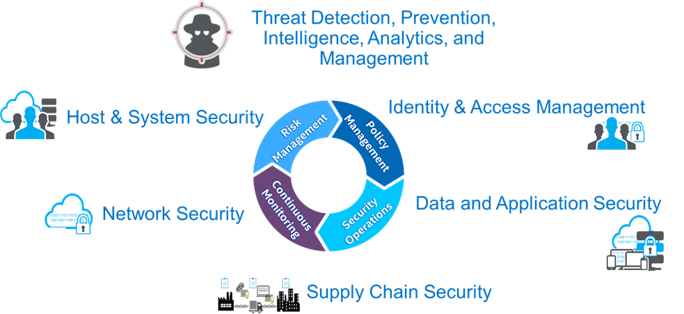
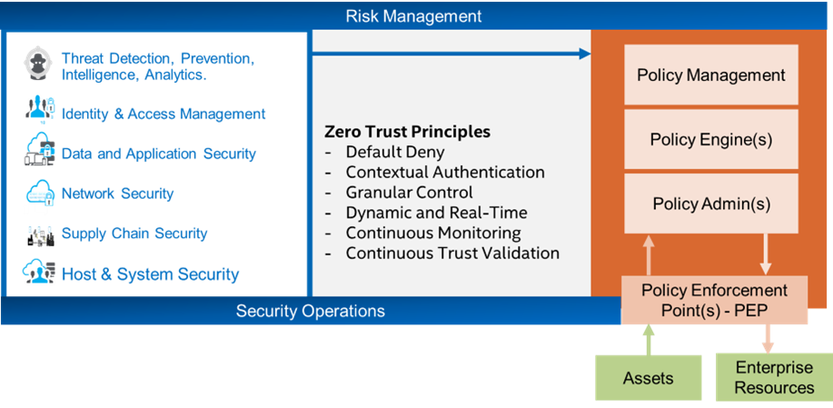
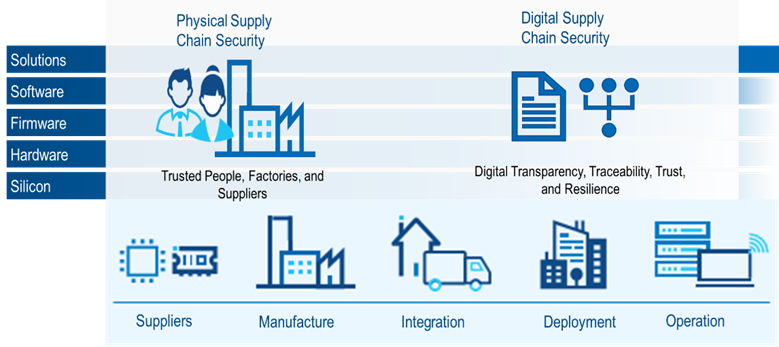
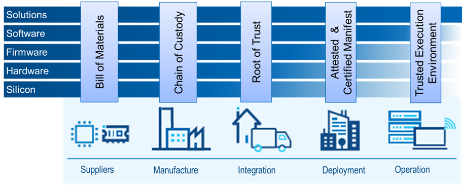
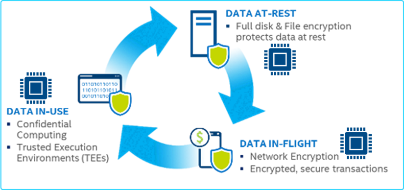





---

## Cyber Threats

The types of cyber threats are constantly changing as bad actors continue to invest time and money into infiltration technologies. Keeping up with these changes is extremely difficult for organizations. this is prevalent in the recent cybersecurity numbers, which show little to no change in organizations’ ability to detect and remediate cyber threats to their infrastructure. The promise of zero-trust architecture solutions to protect against these ever-changing attacks seems hard to realize.

## Cyber Security Six Domains

Before organizations can deploy a zero-trust architectural solution, they must understand the critical elements of deploying cybersecurity systems. These systems can be grouped into six cybersecurity domains. Understanding these domains help organizations build a resilient cybersecurity system.

* Threat detection prevention intelligence analytics and management – This has been the primary focus of most cybersecurity products over the last ten years. Detecting cyber intrusion and remediating threats is the primary focus of most cyber security organizations.
* Identity and access management - identity and access management are moving beyond users' traditional access controls to access control of users’ devices and applications to other assets in the organization, including devices networks and, most importantly, data.
* Data and application security - this requires new thoughts of data and application encryption Techniques that encrypt data at rest, in transit, and in use. Silicon encryption is now available In client devices, server devices, and the cloud. Encryption of data and applications in use requires hardware-enabled confidential computing.
* Supply chain security - securing the supply chain requires more than generating a bill of materials for hardware devices. Supply chains include hardware, firmware, software, and solutions.
* Network security - New types of security topologies and control plane technologies are improving network security which can provide dynamic isolation of resources and infected assets in operational infrastructure.
* Host and system security - Security is only as good as its weakest link, ensuring hosts and systems security, including boot guard technologies, are leveraged to guarantee devices have not been infiltrated with zero-day attacks or malware injected into the BIOS or firmware of the device.

## Building Zero Trust Solutions

After organizations understand the six domains and the tools available in them, they should apply the guiding principles of zero trust architectures to those domains to build a cyber-resilient zero trust system. 

 

These principles include:

* Default deny - access to assets and resources is only granted through explicit requests following regulatory policies and defined processes.
* Contextual authentication - provides mechanisms to authenticate users, devices, and applications based on temporal, policy, situational, and environmental contexts.
* Granular control - provides direct access to groups of assets, individual assets, and even subsets of assets, for example, files in a file system directory or rows in a SQL database.
* Dynamic and real-time - provide dynamic and real-time threat analysis and cyber security policy enforcement based on environmental and situational contexts.
* Continuous monitoring - don't rely on event-driven architectures to provide complete and accurate status of assets and enterprise resources.
* Continuous trust validation - validate that a person is authenticated and has access to assets and resources in the context of the current operating environment and the temporal space allocated for access.

When these principles are applied to the security domains, organizations can build a policy-driven zero-trust architecture that provides a responsive, resilient cybersecurity platform that reduces risk. However, process and organizational changes must be made to establish a policy administration role to define and enable policies that can be enforced through automated cybersecurity systems.

## Secure Supply Chain

Creating a zero-trust solution does not mediate all an enterprise’s cyber-attack vulnerabilities. One area of concern is the security of the supply chain of IT solutions. Organizations must understand the solutions' five components to fully protect the supply chain: silicon, hardware, firmware, software, and systems integration. Each element of a solution how's a supply chain which includes suppliers of raw materials, manufacturers, integrators, deployment, and operations. The deployment and operations typically are performed by the consumer, but As organizations begin to provide XaaS offerings, they deliver the deployment and operations functions.

Organizations must understand the supply chain of each component in the stack. Understanding these five levels can be complex and overwhelming for anyone in the IT solution space. Simplifying this complex ecosystem can help organizations wrap their head around areas to improve and help mitigate risk. The first simplification comes in identifying physical and digital supply chain security.

### Physical Supply Chain Security

The COVID-19 pandemic showed the world the fragility of our supply chain as factories shut down due to a lack of physical supply based on shortages of raw materials and their derivatives. This continued to be exacerbated by the outbreak of war in Ukraine as supply chain channels continued to be cut further. The complex global supply chain had a ripple effect across unrelated industries. For example, a chip shortage causes delays in the delivery of hundreds of thousands of automobiles to consumers and government agencies. Securing the physical supply chain is critical to our national security.

Significant efforts have been made to improve the physical supply chain by investing in local manufacturing through partnerships with the public and private sectors, like the passing of the CHIPS act and subsequent investment in central Ohio by Intel and other technology companies to build silicon and to hardware manufacturing facilities in the silicon heartland.

### Digital Supply Chain Security

Identifying the components that comprise solutions and documenting their use and operating parameters have been standard procedures most organizations follow for hardware and physical product development. However, providing this same level of security for firmware software and solutions is not observed in the IT solution space. To improve this situation, organizations must look at the providers of the five solution component levels concerning the providers and set expectations for their deliverables.

* Suppliers - Provide a bill of materials for all components in the solution stack, including software, COTS libraries and code, firmware, BIOS, hardware, and even Silicon manufacture components. Understanding the source location, version, and certification level is critical when evaluating vulnerabilities in an organization against assets in operations. The best example of this is the log4J vulnerability in 2022. many organizations have no idea how many applications depended on the log4J library and were exposed to cyber-attacks.
* Manufacturers - Provide a chain of custody Ledger that shows who and what has accessed the product being developed through the development lifecycle process, including silicon, hardware, firmware, software, and solution stacks.
* Integrators – Provide products with a hardware root of trust to assure consumers that solutions have not been tampered with or altered from the original manufacturer’s specifications and production manifest.
* Deployment – Provide tested and certified manifests that can be checked against product delivery to guarantee no changes have been made during deployment.
* Operation – Provide mechanisms to monitor and execute applications and IT solutions in trusted execution environments.

## Data and Application Security

The last step in securing the supply chain is providing trusted execution environments for products to run securely and safely. To protect data and applications from cyber threats, including ransomware and data breaches, organizations must encrypt their data, at rest, in transit, and in use. Leveraging silicon in enabled encryption and decryption algorithms are critical in providing performance and reliability of application and data security.

New technology such as intel's SGX and TDX provides data encryption to prevent new cyber attacks on clear text memory execution. These technologies can be found in server and cloud service provider offerings under confidential computing.

 
## Conclusion

The battle with cyber bad actors will not go away anytime soon. However, organizations can prepare themselves two better combat and mitigate risk. Applying zero trust principles to the six domains of cybersecurity will profoundly affect an organization’s ability to combat cyber bad actors and mitigate risk across their infrastructure.

 Podcast Transcript 

1

Hello, this is Darren

Pulsipher, chief solution,architect of public sector at Intel.

And welcome to Embracing

Digital Transformation,where we investigate effective change,leveraging people processand technology.

On today's episode,the state of the Cyber threat Waysto reduce and address risk.

Today on the show, it's just me.

I'm going to talk a little bitabout the state of the cybersecurity todayand threats that are going on and waysthat we can help reduce thoseby looking at the sixdomains of cybersecurity,which we've talkedabout on the show before.

So you can check out the other episodes,just type in cybersecurityor six domains and and you'll find outthe other episodes on this.

But I want to give a little bit of updateand focus a little bit moretoday on the secure supplychain and application and datasecurity.

So let's dive right in.

First off, let's take a lookat the state of things today.

Cyber threats with the warbetween Russia and Ukraine, we've seena major increase, about 300% increasein nation state attackson soft targets in the United Statesand in Western Europe.

And we're also seeingthat trickle down into non nationstate attacks as well as cyber bad actorsare starting to feel more empoweredand they're they're starting to attacktargetsthat before have been kind of ignored,including a lot of targetsin the critical infrastructuresector, which includesenergy, water treatment,oil and gas refinery, health careand the list goes on and on.

CISA has 16 sectorsthat they've identified as criticalinfrastructure, and we're doing our bestto shore those up.

But today,they currently are a soft target.

So we got towe got to take a look at what we can doin those areas to help improve things.

But we've had some major attacksover this last yearthat have caused substantial financialand in some cases physicalharm to individuals and to infrastructure.

In fact,last year it's predictedthat data breaches have cost about $5.2trillionglobally and have exposed 22.1 billiondata records in the history of uscollecting dataaround cyber attacks and databreaches on average.

Most enterprises are trying to combat thisby using severaldifferent security products,and on average,most organizations are using aroundto secure their networks,which I think is interestingbecause in some respects,increasing the number of security productsincreasesthe threat attack surface.

So it's an interesting dilemmathat you have.

One of the best quotes that I've heardis in Information

Security by Bruce Schneier,

Complexity is the worst enemy of security,and I totally agree with that.

The more complex your systems are,there's bound to be more gaps involved.

All right.

So we've got to figure out ways toto combatthis in a in a in a better way.

And frankly, we're not doing very well.

If we take a look at the statisticson how long it takesto identify an attack and how longit takes to contain the attack,we haven't really seen any improvementover the lasteight years or so.

So from 2016 until now,it takes around 70 days to oncewe've detected an attack,an infiltration,it takes about 70 days to contain it.

That's that's over two months.

That's a long time.

But it's even worse when you look athow long it takes to actually identifythat you've been infiltrated,which is up to around 200, a little overmuch in the last eight years.

A little bit of ebband flow have happened, but the cost,the cost of a data breach has gone updramatically.

A data breach on averagenow is costing about 10% more or 4.4$4.35 million per data breach.

That's quite substantial.

So we got to do something about this asand this isthis is kind of a game for a catand mouse game for a lot of people.

It's a battle for sure.

So as we increase our ability to defendthe bad actors, increase their ability toattack, in fact,the attacks are evolving very quickly nowand we're starting to see more attacksspecifically in five different areas.

Ransomware attacks are becomingmore prevalent and they're not.

And this is interestingabout ransomware attacks.

I had a great interview with

Jim Freberg,who talked about the differencebetween federal attacks, attackson our federal government and attackson state and local governments.

Attacks on state and local governmentstend to be more ransomware attacks.

Why? They're softer targets.

It's not really a nation stateattacking you to get money.

It's it's more,you know, bad actors, organized crimeor whatever the case may be, terrorists,whatever that need money.

Right.

That ransomware attacks are primarilyfocused on state and local governmentsand some critical infrastructure,not so much on the federal governmentspace, because they can handle thosepretty quickly.

Another interestingattack that we're seeing is Cryptojacking,wherepeople are actuallyusing your infrastructure to mine crypto.

And it typically consumes about 40%of your resource of your endpoint,whether it's your laptopor an edge device of another sortor even your phones.

Even now, we're starting to see cryptojacking happen.

About 40% of your resources areare infected at this time, and it could gomonths and months and monthswithout detection because they're prettythey're pretty smart about how they'redoing crypto mining.

They're not doing it when someone elseis using the computer, they're doing itwhen your computer's just plugged inand sitting idle.

And sometimes they just take overthe whole thing and just go to town on it.

Another interesting attack that we'reseeing is control flow hijacking.

Now, this one's an interesting one,a fairly new one.

Well, it's not that new,but we're starting to see more of it.

And that's where they'retaking legitimate application codeand accessing data inside of the system.

So understanding that, hey,that application's doing whatit should be doing,but now it's accessing resourcesand sending it other placesthat it normally does not.

So that's a big concern, right?

Because that's a way to to hijack data andand get data out of organizations.

The next one is firmware attacks.

Now, this one is really interestingbecause as firmwareis typicallypretty hill held pretty tight,but we're starting to seemore attacks on firmwarewhich is below the operating system.

And firmware attackshave grown about five Xover the last three years,which means they're injectingthose attacks in the firmwarebefore it actually gets released,which leads to the lastbig evolving cyber threat,which is supply chain.

And this is specifically we can talkhardware, software, silicon supply chaincorruption or supply chain infiltration.

We've seen some of this,the most popular or infamous,

I should say, one that we've heard aboutis the SolarWinds attack,where they actually attackedthe DevOps pipeline.

And in doing so, they injectednew libraries into the softwaresupply chain that were their own librariesand then certified them.

And it's amazing, right?

So these are really big problemsthat we have to deal with.

As you can see,these are not your normal threatsthat we've seen over the last sixyears or so.

They're changingand webreak them down into three categories.

We can see the different vectorsof those attacks that are being used.

And the first one are people attacks.

And believe it or not,the number one attack,

Start with phishing.

The phishing attack.

I it sounds silly.

We all know. Don't click on that link.

But boy, they're getting really goodat phishing attacks.

In fact, just recentlywe're starting to see attacks,phishing attacks on discord,which is really interesting.

Right, that you would think, hey, discord,that's a little more controlled.

Na na.

We're seeing not just email phishing,but social media of phishing attacks.

We're seeing social engineeringwhere people are being groomedonline,being groomed by cyber bad actors, right.

Where they're share, wheretechnologists are sharing informationthey should not be sharing on socialon social media to gain access toto information about them or their companythat cybercriminals are starting toto use to attack their infrastructure.

We also have the insider threat.

That's always a problemwhen you have people involved in somehighly classified type of informationand things like that.

So those are some thingswe have to worry about.

We're also seeing process attacks.

Now this one is kind of new.

Well, it's been around for a long time,but we're seeing a really huge uptickwhere people are actually attackingthe build processand injecting themselvesinto these build processes.

Batch management,the software development lifecycleor even the hardware developmentlifecycle, which is much longer.

We're seeing attackseven at the hardware and design level,which is really interestingbecause these attacks are now in siliconor in a motherboard and now they're beingproduced in mass produced and sent out.

So we're startingto see those types of attacks.

We've got to be very mindfulof of those things.

And then we also have technology attacks,which are primarily software attacks.

Now, we're veryused to software attacks likethe software memory attacks, D

DOS, SQL injectionand ROP and chop those things.

We've seen those before.

They're continuing to happenand they're finding new ways to infiltrateusing those techniques.

Now, a lot of times people say,

Oh, this is all in the IP space.

What we're seeing actuallyit's starting to move overinto the OTT space in a big way.

And in OT has been really good in the pastat isolating themselves fromthe the the internetfor no better word,which means they're isolating themselvesfrom a lot of these attacksby firewalls or air gapped networks.

But hey guess what we're starting to seecyber criminals and cyber bad actorsjump the air gap into the spaceand they're not prepared because they'verelied on this really solid.

They call it the Purdue model.

They've they've relied on this reallysolid fortress that they've created.

But once someone's punchedin, it's it's soft on the insideand they're going hog wild,crazy on there.

Now, if we look what is happeningbehind these attacks,we find some common threads.

If you look at data breaches, supplychain attacks and ransomware,the three big ones there of the five,let's focus on these three.

We see common thread, poor cyber hygiene.

These are basic things.

I like password protection,setting access management.

These arethese are basic things that we should talka little bit about in a minute.

But there's other thingsthat we're seeing here too.

On the data breaches.

We're seeing systemcentric security and datacentric security are separate.

So people aren't.

They're worried more about hardware accessthan data access or application accessmore than data access.

And there's a really big lawlack of egress, monitoring in my watching,where my data is going outsideof my data center out, so my cloud serviceprovider, whatever the case may be.

So those are some big thingson data breach that we're not doingwell at on supply chain attacks.

This one, it worries me a lot actually,because we don't really havegreat visibilityor accountability into our supply chains,both hardware and software.

And we'll talk moreabout supply chain attacks.

We're also basing things on just eventdriven monitoringinstead of continuous monitoring.

So we only raise a red flagwhen something bad happens.

But we're not we're not continuouslymonitoring to see what's going onand looking at patterns of changeand things like thatand a lack of just specific productmonitoring that we should be doingthat we're not both on the hardware sideas we're building hardware up,and that includes the process monitoringand also on the software side, as well.

And then the last major threatand what's behind it is that ransomware,again, poor cyber hygiene, phishingattacks areare rampant in the ransomwarearena.

We also have a lack of defense in depthin a lot of our infrastructure.

We rely on that hardened shell onthe outside and it's soft in the middle.

So we've got to do a better job atlooking at things like micro segmentationand other tools like thatwhere I'm hardening throughout.

And so I need to do a better jobwith my security overall onon all these things, specifically aroundpolicy and risk management.

So let's talk a little bitabout cyber hygiene,since it was thenumber one issue that we saw.

So cyber hygiene, what it is.

Well, there's some really great resourcesout there that give yousome ideas on best practices,on cyber hygiene.

But basic security and risk managementpractices is really good cyber hygiene.

So you need to establish policiesand then implement those policiesacross your organization,not just in one pocket.

Right.

And things such as least privilegedmicro segmentation, encrypting everything,multifactorauthentication, patching,getting those security patches up to date.

These are your blockingand tackling of cybersecurity.

If you don't do these things,all the other fancy things that you dojust aren'tgoing to matter as much, right?

You're stillopening the gates to everyone, basically,which is going to be hard to manage.

So check outand you can Google this anywhere, frankly,cyber hygiene, best practices, there'sthere's tons of great ones out there.

You can also look at the nice standard,great ideasthere on how to secure your organization.

And I can seem overwhelming at times.

But if you look at the key principlesand you start at the top at theat the phishing, for example,phishing or multifactor authentication,if you start with just those two,you're going toyou're going to be so much more securethan you are right now.

So real quick, let's jump overto cybersecurity domains.

So Intel's position on thisis that there's six cybersecurity domains.

If we look at cybersecurityand break it into six bundles,there's threatdetection, prevention and analytics.

There's identity and access managementthis year, multi-factor authentication,there's data and application security,there's supply chain security,network security and host and systemsecurity.

Now, each one of these has a playand working them together.

And and it'snot just focusing just on detectionor just on supplychain is going to be good enough.

You've got to have a well-roundedprocess solution,whatever the case may be.

It has to be well-rounded.

You've got to you've got to touchall six of these areas to have and builda strong security castle or fortress.

Well, we've this is interesting.

When you look at these six domains,they really haven't changedmuch over the years.

The technology and processimprovements have.

But if I take a look at the evolutionof cybersecurity, it's really fascinating.

Each one of these six areas,all have a playall the way back to the 1990s,all through all the different typesof things that we saw,sometimes we focused more on like dataand application security with encryption.

And other days we looked at, Oh,we need to secure the supply chainlike software development,supply chain, or hey, we need to doidentity managementbetter with multifactor authentication.

But they all touched parts of it.

And until we get to today and today,

I find very interesting the big hugebuzz word of the day,of course, is cybersecurity architecture.

And I really don't like the name I see.

Or zero trust architecture.

Sorry, I really don't like the name zero

Trust architecture.

I think it should be zero trustphilosophy or principles,because when we hear the wordarchitecture, we are automatically think,

I can just go buy that,but you really can't.

Zero Trust means changesto process, changesto paradigm,the way you think about thingsand tools and training people.

So goes back to thatpeople process policy and technology.

So let's take a look at what it takesto enable zero trust First.

The first thing you have to understandare the six domains,which we already talked about threatdetection, identity managementdata and application security, networksecurity, supply chain security and hostand system security, understanding thoseand then applying zero trust principles.

These are interesting.

So trust principles like default, deny,don't let anyone in by default.

Don't. Don't let anyone in.

Contextual authentication,including temporal authentication.

Meaning

I have access for a short period of timeor a designated period of time, granularcontrol all the way down to data elements.

If you need it right.

Dynamic and real time controls,continuous monitoring, continuoustrust validation.

I trusted you once.

I trust you again.

All right.

I've got

I got to establish these key principles.

Now, if I apply those principlesto the six domainsusing processand technologyand training of your people,then I can truly start deploying a zerotrust architecture,which includes policy management,automation on your policy engine,creating the policyadmin, the Security Policy Administrationrole in your organization.

Which means if I doall of that together, right,then I can look at true policy enforcementat the endpoints,which means I'm getting informationfrom my assets on their current state,and then I am enforcingthose policies on those resourceswhich include not just hardware,not just virtual machinesor containers, but data applications,devices, virtual devices,virtual machines, containers, everythingnow fits into that default.

Deny and that zero trust principle,meaning everything has an identity,everything has access rightsthat I need to work through.

And this is really,really important concepts.

So let's take a little bit deeper.

Look into the best practices.

Where do you begin?

Well, you start with the six domains.

So if we start with the six domains,there's a lot to unpack there.

We can be

I could I could do a podcast on eachone of the six domains, which I might do.

Right.

So stay tuned, come back and listenand look, because we will do this.

We'll go through each domain in detail.

But today I'm going to talkspecifically about the supply chain,secure supply chain,that this is really become more complexthan we even realized,because if we look at the secure supplychain,we're not talking just and a lot of timeswhen you hear supplychain, you're thinking shipsitting off the coast of California,not able to come into portor fuel prices, driving uplogistics costs,all of those are those are part of it.

But that's not all.

When we look at supply chainin the microelectronics world,we have to look at silicon andwe have tolook athardware, we have to look at firmware,software and then solutionsthat I'm building on top of that software.

So I have to look at the supply chainof each one of thosebecause each one is unique.

Well, this could be overwhelmingfor any organization.

I got a I got to learn

I got to be an expert in all these things.

Well, the good news is.

No, you don't.

You there's some common themesthat we can seethroughout all of them that if we applysome general zerotrust philosophy against them,we'll be able to startto establish some securityin each one of these domains instead ofjust being a free for all right.

So if I take a look at those fivehorizontal solution software,firmware, hardware, silicon,and I look through its lifecycleand if I look at its lifecycle,which I could sayalmost on a vertical space,

I got suppliers of those,

I have manufacturers,

I have suppliers, I've got manufacturers,

I have an integrator, I have deployment,and then I have operations.

So that's kind of the lifecycleof each one of those those five levelsin my solution chain.

So if I look at each one, I've got to say,all right, well,how do I secure the supply chainfrom the supplier to the manufacturerto the integrator to deploymentand to operations of silicon?

How do I do that for hardwarefor each one of those?

Well, there's something really interestingabout this.

We can break downsecuring this in two waysphysical security and digital security.

So physicalsecurity and we've already seen thiswith like things like Fedrampand the gov cloud, right where

I have trusted people in those govclouds, right?

They are U.S. citizens.

They they go through the whole processto be certified, to be fedramp certified,and that I trust the peoplein those factoriesand the suppliers in those factories.

We have a process for that at theat the topat the solution stack,which is really interesting.

And it also includes a little biton the software stack.

So that's that physical supplychain security.

We are working feverishly right nowand that's why we're building fabsin Ohio, in Arizona and New Mexicoand in Europe to shore uptrusted factories in the United Statesand in Europeso that we can have that physical supplychain security that we need as well.

So that's being doneor in the process of being done today.

If you look at where hardware comes from,if I just have like a motherboard,for example, it is amazing.

If you broke it downto all the individual components,how many countries in the world contributeto that, which is part of globalization.

But when you get globalization like that,you also havefragile supply chainsthat you have to worry about.

That's why we're seeing so much investmentin into the United Statesto build out the supply chainsin a moretrusted way, in a more secureand reliable way.

Right now on the digital supply chain,the digital supply chain security,this is interestingbecause we really haven't done a great jobhere.

We've started to in thereand people have been playing aroundwith like blockchains and secureblock ledgers and and things like that.

But we haven't seen wide adoptionat the top and the solutions stackwe're starting to see it at the bottom,at the silicon layer,at the hardware layer,where I can go and see a bombof a device and I can know whereall the components have come from.

We're seeing that.

We're starting to see that now.

But on the software side,which you would think would be easiestbecause we're building the software,we know where it all came from,where we got when I see that yet.

But there are mandatesto provide software bombs,executive orderin Q2 of this year and in Q2 of 2023,we'll see if will be able to pull it offas a industry.

There are companiesthat are ahead of this.

They are providing a s bombs already,software bombs,and there are some good standardsout there that are being adopted now,but it's still in its infancy.

It's still very nascent.

Now, another thing that we need to look aton securing the supply chainis if we look at eachlevel inside the supply chain,starting with suppliers,manufacturers, integration,deployment and operations, whatcybersecurity techniquescan we use in each one of those?

And this turns out to be actuallysomething I can apply acrossall five horizontals,meaning the solutions, the hardware,firmware, software, silicon, rightbelow materials is one from the suppliers.

So if I request or mandate,

I need to build materialsfrom my supplier.

This should help out quite a bit. Right?

Because I know where my silicon came from.

I know that it came from a factoryin Portlandor a factory in Ohio or a factory in

Arizona or a factory in Dalian, China.

I can get access to that at the hardware.

Same thing.

Firmware softwaresolution stacks all the way at the top.

I should be able to go to a cloud serviceprovider and say, You'reproviding this service like Ardis,for example, AWB already has, or Azure

SQL Server.

You should be able to say what what wasput in there to make that work,

Which software stacks and which hardwareis it running on in the firmware?

I should be ableto get access to those bombs.

So that's the benefit of the bombs.

It helps build up some trustwhich goes into the next partis when I'm manufacturing something,

I want to make sure that I'm protected.

So I need a chain of custody.

I need to know that nothing's beeninjected into the manufacturing process.

As I've gotten my supply, I I'm startingto build out my manufacturing.

We do this in hardened,hardened operational pipelinesand there's some great technology on thisaround trusted execution environmentswhere I can make sure I knowwho has touch of the softwarethat's being built, who has touchedthe silicon or the hardware,and that gives me that chain of custody,who has touched it,who's manipulated itall that the next one is integration.

So once it's manufactured,now I'm getting up to the integration.

We want to make sure that nothing changeshere, right?

So we need to establish a route of trust,meaning I trust where this came from.

And I can guaranteethat during integration it's not changing,that those core foundational partsare not changing.

And then when I get to deployment,

I can use that route of trustto do attestationand certification of my manifest.

So now I have everything I need in there.

I can say, yes,every part of this solutionor silicon or hardware that I'm deliveringhas been attested and certified.

I know exactly what's in there.

I certify that that it's true.

Now, we'veseen attacks right hereat this deployment levelin when people have been attackingsoftware supply chains.

We're starting to see that happen.

So you got to lock downyour environment there.

And then this is really interesting,the last step here,and it's on the operations side.

It is I can

I can have the most secure products.

You've got me.

And then if on the end,when I'm running an operations,if I don't usea trusted execution environment,if I'm not establishing trust there,it doesn't matterif I open upall of all of my firewallrulesif I don't do access it anyway,anyone can access anything they want.

They'reall the work down from the supplierup to operations.

Doesn't matterbecause I've opened everything up.

So I need to establish dataand application security at this, at thisoperation side.

So which brings you to the next domain.

I want to quickly talk about,which is data and application security.

So when I talk about data and applicationsecurity,

I'm talking about encryptingand access managementand see how they all tie togetherthe domains.

But let's specifically talk about dataand application security real quick.

This means encrypting data.

Data at rest, data in in flightand also data in use.

So if I look at data at restand data in flight, thesea lot of people are avoiding this becauseencryption costs too much time, right?

It's like 20% overhead.

It is not.

It's like single like 1%,maybe even less than 1%,depending on what you're encrypting,because a lot of the encryptionalgorithms are now in silicon,which meansyou can take advantage of the siliconto do the encryption for youand everything is encryptedend to end encryption.

And with new technology that we're seeing,like trusted execution environments,

I can also encrypt memory as I'm using itso no one can get access to itthrough a side channel attackor whatever the case may be.

So take a look at trusted executionenvironments in encrypting data in use.

It's very important as well.

And then the last thing

I just want to make sure everyoneunderstands, to really achievecybersecurity and resilience,you've got to look at the sixdomains, apply the zero trust principles,and build a zero trust organizationthat can really help establishcybersecurityand resiliency.

Thank you for listeningto Embracing Digital Transformation today.

If you enjoyed our podcast,give it five Stars on your favoritepodcasting site or YouTube channel,you can find out more informationabout embracing digital transformationand embracingdigtial.org

Until nexttime, go out and do something wonderful.

