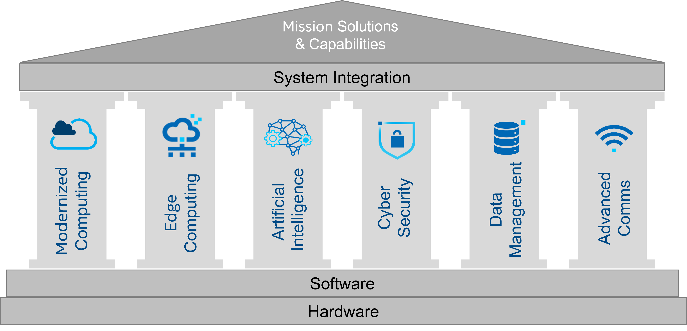

# Pillars

Digital transformation has been on everyone’s strategic bucket list. Intel sees the big strategic bets in digital transformation in the coming year as Multi-Hybrid Cloud, Edge Computing, Cyber Security, Artificial Intelligence, Data Management, and Advanced Communications. Intel is deeply involved with all of them, as they have built the hardware and software to support each of the pillars. The pillars are interwoven, and Intel plays a crucial role in leading the industry forward.

<!-- ShareThis BEGIN -->

<!-- ShareThis END -->

* [Ubiquitous Computing](/tags/compute) – Modern application and service development must be supported by 
  multi-hybrid 
  cloud architecture, and high performance computing.

* [Edge Computing](/tags/edge) – More capabilities are being pushed to edge devices enabling new use models and 
  development techniques.

* [Cyber-Security](/tags/cybersecurity) – Cloud and Edge have increased the attack surface of an already vulnerable 
  security position for many organizations.

* [Artificial Intelligence and Data Analytics](/tags/aiml) – Creating information insight from the vast amount of data 
  generated on edge is key to an organization’s viability in the future.

* [Data Management](/tags/data) – The data is no longer bound to the data center's walls, causing data sprawl, 
  duplication, increased cost, and data reliability issues.

* [Advanced Communications](/tags/comms) – New communications like 5G are opening new doors to types of solutions at the 
  edge never thought possible before.
